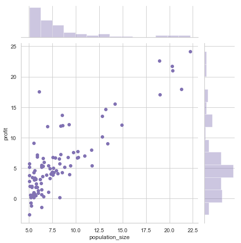
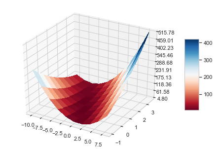
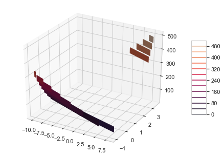
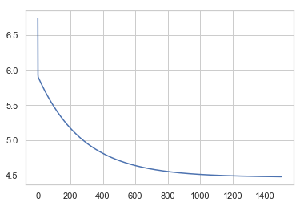
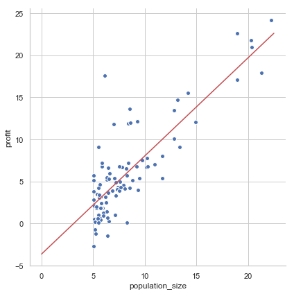

# Machine Learning using Univariate Linear Regression

Estimating the profit from a city basing on its population size.


```python
import pandas as pd
import numpy as np
import seaborn as sns
import matplotlib.pyplot as plt
from pylab import meshgrid, cm
from mpl_toolkits.mplot3d import axes3d, Axes3D
from matplotlib.ticker import LinearLocator, FormatStrFormatter

sns.set(style="whitegrid")
```

### ======================= Part 2: Plotting =======================


```python
print('Plotting Data ...\n')
data = pd.read_csv('ex1data1.txt', names = ['population_size', 'profit'])
print(data.head())
```

    Plotting Data ...
    
       population_size   profit
    0           6.1101  17.5920
    1           5.5277   9.1302
    2           8.5186  13.6620
    3           7.0032  11.8540
    4           5.8598   6.8233


```python
x = data['population_size'] # training set
y = data['profit'] # labels
m = len(y) # training size
```


```python
# plots the data
# f, ax = plt.subplots(figsize=(6.5, 6.5))
# sns.despine(f, left=True, bottom=True)
# sns.scatterplot(data=data, x="population_size", y="profit", sizes=(1, 8))
sns.jointplot('population_size', 'profit', data=data, color="m", height=7)
```


    <seaborn.axisgrid.JointGrid at 0x116b0ac18>





### =================== Part 3: Cost and Gradient descent ===================


```python
# Add a column of ones to X to facilitate the manipulation
# X = np.array([np.ones(m), x])

X = np.column_stack((np.ones(m), x))
# row is input and columns is features
# X[0][1]
```

Initialize fitting parameters $\Theta = [0, 1]^T$ (fixed to 0 to validated the output from computCost and gradient descent).

Learning rate $\alpha = 0.01$.


```python
theta = np.zeros([2])
# Some gradient descent settings
iterations = 1500;
alpha = 0.01; # learning rate
```


```python
print(np.shape(X))
print(X[:5])
print(np.shape(y))
print(y[:5])
print(np.shape(theta))
print(theta)
```

    (97, 2)
    [[1.     6.1101]
     [1.     5.5277]
     [1.     8.5186]
     [1.     7.0032]
     [1.     5.8598]]
    (97,)
    0    17.5920
    1     9.1302
    2    13.6620
    3    11.8540
    4     6.8233
    Name: profit, dtype: float64
    (2,)
    [0. 0.]


### Hipoteses Function
Function that defines our linear model.

Definition:

$h_\theta(x) = \theta_0 + \theta_1 * x_1$

Vectorial form:

$h_\theta(X) = \Theta^{T} * X$

where:
$X = [x_0, x_1]$ and $x_0 = 1$,
$\Theta = [\theta_0, \theta_1]$


```python
def hipotese(X, theta):
    return [np.dot(xi, theta) for xi in X]
```

### Compute cost for linear regression
`computeCost` computes the cost of using theta as the parameter for linear regression to fit the data points in X and y.

Function cost:

$ J(\Theta) = \frac{1}{2m} \sum_{i=0}^{m} (h_\theta(x^{(i)}) - y^{(i)})^{2} $

Expecting 32.07 at first iteration as $\Theta$ was initialized with $[0, 0]$.


```python
"""
Inputs:
X = [
  [ x0, x1 ]
]
y = [
  [ ]
]
theta = [ theta_0, theta_1 ]
"""
def computeCost(X, y, theta):
    m = len(y)
    h_theta = hipotese(X, theta)
    j = (1 / (2 * m)) * ((h_theta - y) ** 2).sum()
    return j

```

Testing the cost function with $\Theta = [0, 0]^T$


```python
# compute and display initial cost
J = computeCost(X, y, [0, 0]);
print('Cost computed = %f' % J);
print('Expected cost value (approx) 32.07\n');
```

    Cost computed = 32.072734
    Expected cost value (approx) 32.07
    


Testing the cost function with $\Theta = [-1, 2]^T$


```python
# further testing of the cost function
J = computeCost(X, y, [-1, 2]);
print('Cost computed = %f' % J);
print('Expected cost value (approx) 54.24\n');
```

    Cost computed = 54.242455
    Expected cost value (approx) 54.24
    


### Running Gradient Descent
We use gradient descent to find the hyperparameters values $\Theta$ that **minimize** $J$.
In each iteration we calculate a $\Theta'$ where $J(\Theta') < J(\Theta)$.

This $\Theta'$ defined by $\Theta' = \Theta - \alpha * \nabla h_\theta$, where $\nabla h_\theta$ is the amount we need change to *minimize* $J(\Theta)$ and $\alpha$ is the step we will take.

If $\alpha$ is too large we could ending increasing $J$, it need to be small enough to converge quickly to the points the $J(\Theta)$ is minimum.


Step to update each parameter:

$\Theta_j := \Theta_j - \alpha * \frac{\partial J}{\partial \Theta_j} $

Where:

$\frac{\partial J}{\partial \Theta_j} = \frac{1}{m} \sum_{i=1}^{m} [( h_\theta(x^{(i)}) - y^{(i)})$ when $j = 0$ (bacause it is the bias - doesn't have a feature).

$\frac{\partial J}{\partial \Theta_j} = \frac{1}{m} \sum_{i=1}^{m} [( h_\theta(x^{(i)}) - y^{(i)}) * x{(i)}]$ when $j = 1$.


`gradientDescent(X, y, theta, alpha, num_iters)` performs gradient descent to learn $\Theta$ parameters.

It return the an array with $\Theta$ containing the values found by taking num_iters gradient steps with learning rate alpha.

Also it return a array with the history of $J(\Theta)$ to be plotted.


```python
# calculate the theta_0 and theta_1 individually
def gradientDescentManualWay(X, y, theta, alpha, num_iters):
    m = len(y)
    J_history = np.zeros(num_iters)
    
    for i in range(num_iters):
        h_theta = hipotese(X, theta)
        # update the theta individually
        nabla_theta_0 = (1 / m) * (h_theta - y).sum() # theta 0
        nabla_theta_1 = (1 / m) * ((h_theta - y) * X.transpose()[1]).sum() # theta 1

        # theta[0] = theta[0] - alpha * nabla_theta_0
        # theta[1] = theta[1] - alpha * nabla_theta_1
        theta = theta - alpha * np.array([nabla_theta_0, nabla_theta_1])
        
        # Save the cost J in every iteration
        J_history[i] = computeCost(X, y, theta);
    return (theta, J_history)

# better way using the convenient x_0 = 1
def gradientDescentVectorialWay(X, y, theta, alpha, num_iters):
    m = len(y)
    J_history = np.zeros(num_iters)
    
    for i in range(num_iters):
        h_theta = hipotese(X, theta)
        nabla = (1 / m) * np.dot((h_theta - y).transpose(), X);
        
        theta = theta - alpha * nabla.transpose()
        
        # Save the cost J in every iteration
        J_history[i] = computeCost(X, y, theta);
    return (theta, J_history)
```


```python
print('\nRunning Gradient Descent ...\n')
theta = np.zeros(2)
(theta, J_history) = gradientDescentVectorialWay(X, y, theta, alpha, iterations);

# print theta to screen
print('Theta found by gradient descent:');
print(theta);
print('\nExpected theta values (approx)');
print('[ -3.6303,  1.1664]');
```

    
    Running Gradient Descent ...
    
    Theta found by gradient descent:
    [-3.63029144  1.16636235]
    
    Expected theta values (approx)
    [ -3.6303,  1.1664]


```python
print('Predict values for population sizes of 35,000 and 70,000')

predict1 = hipotese(np.array([[1, 3.5]]), theta)
print('For population = 35,000, we predict a profit of %f\n' % (predict1[0] * 10000))

predict2 = hipotese(np.array([[1, 7]]), theta)
print('For population = 70,000, we predict a profit of %f\n' % (predict2[0] * 10000))
```

    Predict values for population sizes of 35,000 and 70,000
    For population = 35,000, we predict a profit of 4519.767868
    
    For population = 70,000, we predict a profit of 45342.450129
    


### ============= Part 4: Visualizing $J(\theta_0, \theta_1)$ =============


```python
theta0_vals = np.arange(-10, 10, 2)
theta1_vals = np.arange(-1, 4, 0.5)

# initialize J_vals to a matrix of 0's
J_vals = np.zeros([len(theta0_vals), len(theta1_vals)])

# Fill out J_vals
for t0 in range(len(theta0_vals)):
    for t1 in range(len(theta1_vals)):
        J_vals[t0][t1] = computeCost(X, y, [theta0_vals[t0], theta1_vals[t1]])

gX, gY = meshgrid(theta0_vals, theta1_vals)
```


```python
print('Visualizing J(theta_0, theta_1) ...')
fig = plt.figure()
ax = Axes3D(fig)

surf = ax.plot_surface(gX, gY, J_vals, rstride=1, cstride=1, cmap=cm.RdBu, linewidth=0, antialiased=False)
ax.zaxis.set_major_locator(LinearLocator(10))
ax.zaxis.set_major_formatter(FormatStrFormatter('%.02f'))
fig.colorbar(surf, shrink=0.5, aspect=5)
```

    Visualizing J(theta_0, theta_1) ...


    <matplotlib.colorbar.Colorbar at 0x115496f28>





```python
# Plot J_vals as 15 contours spaced logarithmically between 0.01 and 100
fig = plt.figure()
ax = Axes3D(fig)

cset = ax.contour(gX, gY, J_vals.transpose(), 16, extend3d=True)
ax.clabel(cset, fontsize=9, inline=1)
fig.colorbar(cset, shrink=0.5, aspect=5)
```


    <matplotlib.colorbar.Colorbar at 0x115623940>





### ============= Extra: Visualizing Learning Curve =============


```python
# Plot the linear fit
sns.lineplot(range(iterations), J_history)
```


    <matplotlib.axes._subplots.AxesSubplot at 0x1153bd588>





### ============= Extra: Plotting Hipotese Model =============


```python
# fig, ax = plt.subplots()
# sns.jointplot('population_size', 'profit', data=data, color="m", height=7, ax=ax)

# ax2 = ax.twinx()

population_size = np.arange(0, 25, 2.5)
profit = np.zeros(len(population_size))

for i in range(len(population_size)):
    predict = hipotese(np.array([[1, population_size[i]]]), theta)
    profit[i] = predict[0]

# sns.lineplot(population_size, profit, ax=ax2)

g = sns.FacetGrid(data, size=6)
g = g.map(plt.scatter, 'population_size', 'profit', edgecolor="w")
plt.plot(population_size, profit, color='r')
```


    [<matplotlib.lines.Line2D at 0x1180993c8>]





```python

```
